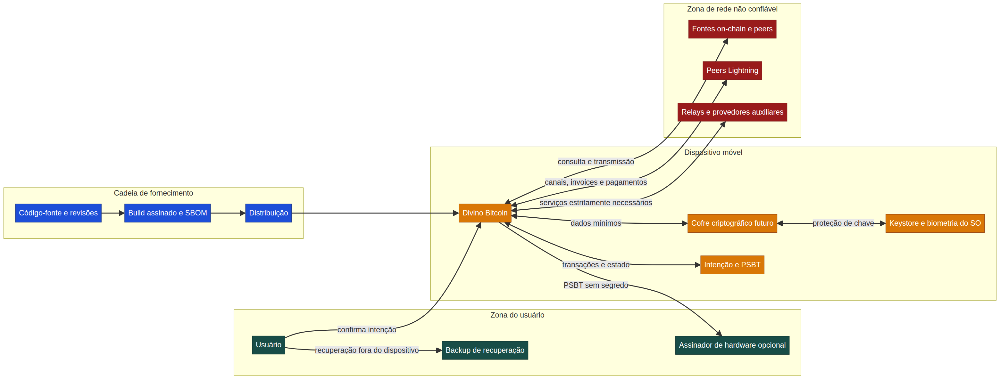

# Modelo de Ameaça do Divino Bitcoin

**Status:** linha de base de arquitetura; não autoriza uso de fundos reais  
**Última revisão:** 20 de agosto de 2026  
**Responsável:** Manus AI, sujeito a revisão comunitária e auditoria independente

> **Regra de transição:** enquanto cada requisito deste documento não estiver implementado, testado, revisado e aceito no gate correspondente, o build do Divino Bitcoin permanece em demonstração e não habilita segredos de cliente, valor econômico ou operação de produção. Signet é o perfil de desenvolvimento padrão. Engenharia, fixtures e testes de laboratório podem avançar antes da aceitação usando material descartável; Mainnet, fundos reais, recuperação do usuário, assinatura, broadcast, endpoints operacionais e Lightning econômico permanecem desabilitados no build atual.

## 1. Propósito e método

Este modelo orienta decisões de produto, arquitetura, teste, revisão e resposta a incidentes para uma carteira móvel aberta e de autocustódia. Ele trata seed, material de assinatura, intenção de pagamento e proveniência de release como ativos de maior valor. A modelagem é centrada nos dados, em seus fluxos e nas respectivas superfícies de defesa, conforme a abordagem do NIST. [1] O catálogo de controles móveis usa os domínios do OWASP MASVS — armazenamento, criptografia, autenticação, rede, plataforma, código, resiliência e privacidade. [2]

O documento utiliza **STRIDE** como lente de cobertura — falsificação de identidade, adulteração, repúdio, vazamento, negação de serviço e elevação de privilégio — sem assumir que uma sigla substitui evidência de teste. Cada mudança que alcance seed, assinatura, transação, backup, canal Lightning, endpoint remoto ou distribuição deverá atualizar este modelo antes do merge.

## 2. Escopo, fronteiras e não objetivos

O escopo futuro inclui a carteira móvel, armazenamento local, fluxo de recuperação, construção e confirmação de transações on-chain, interoperabilidade por PSBT, conectividade com fontes de cadeia, operação Lightning autocustodiada e cadeia de fornecimento de releases. A assinatura e a recuperação devem seguir padrões interoperáveis: BIP-32 para carteiras determinísticas hierárquicas, BIP-39 para mnemônicos, BIP-84 para derivação SegWit nativa e BIP-174 para PSBT. [3] [4] [5] [6]

O modelo não promete anonimato absoluto, disponibilidade de terceiros, proteção contra comprometimento total do sistema operacional, recuperação de uma seed perdida ou segurança de hardware externo. Ele tampouco permite custódia pelo projeto: servidores, mantenedores e provedores não poderão receber seed, chave privada, segredo de canal ou poder de assinatura do usuário. A rede Signet é um ambiente de desenvolvimento com regras próprias de assinatura de blocos, descritas no BIP-325; ela reduz o risco econômico, mas não substitui testes de segurança. [7]

| Fronteira | Premissa de confiança | Regra de segurança |
| --- | --- | --- |
| Usuário e dispositivo | O usuário controla o dispositivo, mas ele pode ser perdido, desbloqueado ou ter software malicioso. | Proteger segredos em repouso, exigir intenção explícita e apoiar recuperação fora do dispositivo. |
| Aplicativo e sistema operacional | APIs do SO e keystore são usadas corretamente, mas não são infalíveis. | Não inventar criptografia; reduzir segredos na memória e usar primitivas nativas auditadas quando a arquitetura for aprovada. |
| Assinador de hardware | Pode reforçar isolamento, mas pode exibir dados incorretos ou ser comprometido. | Exigir verificação humana de rede, destino, valor e taxa; nunca fazer assinatura cega. |
| Rede Bitcoin, Lightning e serviços auxiliares | Todo endpoint remoto é não confiável, observável e pode falhar ou mentir. | Validar dados, limitar metadados, fixar perfis de rede e evitar confiança implícita em um único provedor. |
| Cadeia de fornecimento | Dependências, CI, repositórios, lojas e builds podem ser adulterados. | Revisão pública, lockfiles, SBOM, assinatura/proveniência e releases reproduzíveis quando viável. |

## 3. Ativos e objetivos de proteção

| ID | Ativo | Objetivo principal | Perda mais grave | Proprietário |
| --- | --- | --- | --- | --- |
| A1 | Mnemonic, seed e passphrase | Confidencialidade e recuperabilidade | Perda permanente de controle ou exposição total dos fundos | Usuário |
| A2 | Chaves derivadas, chaves de canal e material de assinatura | Confidencialidade, integridade e uso mínimo | Assinatura não autorizada ou perda de canais | Usuário |
| A3 | Intenção de transação, PSBT, destino, valor, taxa e rede | Integridade e confirmação compreensível | Pagamento ao destino errado, valor/taxa alterados ou rede errada | Usuário |
| A4 | Estado on-chain, UTXOs, endereços e metadados de carteira | Integridade, privacidade e disponibilidade | Saldo enganoso, reutilização de endereço ou vinculação de identidade | Usuário |
| A5 | Invoices, preimages, estado de canal e backups Lightning | Confidencialidade, integridade e disponibilidade | Perda de capacidade de recuperação, pagamento indevido ou vazamento de relações | Usuário |
| A6 | Credenciais locais, biometria e política de autorização | Integridade e resistência a uso indevido | Bypass local de confirmação ou de desbloqueio | Usuário |
| A7 | Configuração de rede, certificados, peers e endpoints | Integridade e privacidade | Redirecionamento, downgrade ou observação indevida | Usuário |
| A8 | Código-fonte, dependências, SBOM e artefatos de release | Integridade, rastreabilidade e auditabilidade | Distribuição de build adulterado | Comunidade e usuários |
| A9 | Logs, diagnósticos e relatórios de falha | Privacidade e utilidade operacional | Vazamento de segredo, endereço, invoice ou identificador do usuário | Usuário |

## 4. Fluxos de dados e invariantes

| Fluxo | Dados | Zona de origem e destino | Invariante obrigatório |
| --- | --- | --- | --- |
| F1 — criação e recuperação | Entropia, mnemonic, seed e verificação de backup | Usuário ↔ cofre local futuro | Seed nunca sai do dispositivo por rede, log, analytics, captura automática, área de transferência ou relatório de erro. |
| F2 — derivação e armazenamento | Chaves derivadas e metadados mínimos | Cofre ↔ keystore do SO | Segredos devem ficar criptografados em repouso, com acesso de menor privilégio e sem armazenamento em AsyncStorage, arquivos de texto ou configuração de build. |
| F3 — preparação on-chain | UTXOs, destinatário, valor, taxa, rede e PSBT | App ↔ assinador opcional ↔ rede | O resumo apresentado ao usuário deve corresponder ao payload assinado e identificar explicitamente Signet/Mainnet, destino, valor total e taxa. |
| F4 — transmissão e sincronização | Transações, headers, filtros e estado público | App ↔ rede não confiável | Dados remotos são apenas entrada não confiável; validação de rede, consistência e falhas de endpoint devem ser explícitas. |
| F5 — operação Lightning | Invoice, rota, pagamento, estado de canal e backup | App ↔ peers Lightning | Nenhum nó ou serviço remoto recebe poder de gasto; segredos de canal e backups exigem desenho dedicado antes de implementação. |
| F6 — release e atualização | Código, dependências, artefato, versão e notas | Repositório ↔ CI ↔ loja/distribuição ↔ app | Cada release deve ser rastreável a commit revisado, dependências declaradas, SBOM e processo de assinatura/proveniência. |

## 5. Atores de ameaça

O modelo considera ladrão com acesso físico, aplicativo malicioso ou overlay, malware com permissões elevadas, atacante de rede, endpoint remoto desonesto, operador de relay ou nó Lightning malicioso, fornecedor de dependência comprometido, invasor de CI, mantenedor mal-intencionado, golpista de phishing, pessoa que acesse backup e agressor que busque indisponibilidade. Atores podem colaborar e agir antes, durante ou depois de uma assinatura.

Um usuário legítimo sob pressão, desatenção ou engenharia social também é uma ameaça operacional relevante. Controles de UX devem tornar visíveis rede, destino, valor, taxa e irreversibilidade, mas não alegar que a confirmação visual elimina coerção, malware ou erro humano.

## 6. Registro de ameaças e controles

| ID | Cenário | Classe | Ativos | Impacto | Controles mandatórios | Evidência de aceite |
| --- | --- | --- | --- | --- | --- | --- |
| T1 | Seed ou chave aparece em log, backup automático, clipboard, telemetria ou crash report. | Vazamento | A1, A2, A9 | Crítico | Proibição por API e revisão; redatores de log; testes negativos; política de coleta mínima. | Testes automatizados de redaction e revisão de telemetria. |
| T2 | Aplicativo, overlay ou malware induz destino, valor, taxa ou rede diferente da intenção. | Adulteração / falsificação | A3, A6 | Crítico | Confirmação vinculada ao payload, resumo legível, rede destacada, temporização de confirmação e assinador com verificação independente. | Testes de mutação da intenção e roteiro de UX de assinatura. |
| T3 | Dispositivo perdido ou desbloqueado permite uso da carteira. | Elevação / uso indevido | A1, A2, A6 | Alta | Cofre do SO, política de desbloqueio, limites locais, bloqueio por inatividade e recuperação fora do dispositivo. | Testes em dispositivo e revisão de configuração nativa. |
| T4 | Fonte on-chain, explorer, relay ou peer entrega saldo, UTXO, taxa ou estado falso. | Adulteração / disponibilidade | A3, A4, A7 | Alta | Validação de perfil de rede, fontes redundantes ou verificáveis, tratamento explícito de divergência e transmissão confirmada. | Testes de resposta malformada, troca de rede e indisponibilidade. |
| T5 | Dependência, CI ou artefato de loja é adulterado antes da instalação. | Adulteração / repúdio | A8 | Crítico | Revisão obrigatória, dependências fixadas, SBOM, análise de licença, assinatura de release, proveniência e verificação independente. | SBOM por release, log de revisão e verificação de artefato. |
| T6 | Backup de seed ou de canal é copiado, exposto ou restaurado de forma enganosa. | Vazamento / adulteração | A1, A5 | Crítico | Educação de backup, confirmação de recuperação, formato interoperável, proteção criptográfica aprovada e proibição de backup em nuvem implícita. | Teste de recuperação em dispositivo limpo e análise de fluxos. |
| T7 | Pagamento Lightning é duplicado, roteado de modo inesperado ou deixa estado de canal inconsistente. | Adulteração / disponibilidade | A2, A5 | Crítico | Motor Lightning auditado, idempotência, limites, confirmação de status, monitoramento de canal e procedimento de recuperação. | Vetores de teste, testes de falha e auditoria especializada. |
| T8 | MITM, DNS ou TLS fraco redireciona conexões e coleta metadados. | Falsificação / vazamento | A4, A7 | Alta | TLS válido, validação de endpoint, sem downgrade silencioso, configuração explícita e minimização de consultas. | Testes de certificado, downgrade e troca de endpoint. |
| T9 | Biometria é tratada como segredo ou autorização de gasto sem política de chave. | Projeto incorreto | A2, A6 | Alta | Biometria apenas libera chave local conforme política do SO; não substitui seed, confirmação de transação ou hardware signer. | Revisão de arquitetura e testes de fallback. |
| T10 | Erro de migração mistura Demo, Signet e Mainnet. | Adulteração / confusão | A3, A4, A7 | Crítico | Tipagem de rede, namespaces de armazenamento, bloqueio por padrão, migração reversível e tela de rede proeminente. | Testes de isolamento e migração de dados. |
| T11 | Metadados de endereços, horários, peers ou pagamentos identificam o usuário. | Vazamento | A4, A5, A7, A9 | Média/Alta | Coleta mínima, sem analytics por padrão, documentação de privacidade e avaliação de cada provedor remoto. | Inventário de dados e testes de tráfego. |
| T12 | Disponibilidade é perdida por DoS, corrupção local ou falha de peer. | Negação de serviço | A4, A5, A7 | Média/Alta | Limites de recurso, cópias de estado, recuperação testada, mensagens claras e não ocultação de saldo incerto. | Testes de stress, corrupção e recuperação. |
| T13 | Revisor ou mantenedor introduz backdoor deliberadamente. | Elevação / repúdio | A1–A8 | Crítico | Revisão por pares, commits assinados quando definidos, separação de papéis, build reproduzível e auditoria externa antes de Mainnet. | Histórico público de revisão e relatório de auditoria. |

## 7. Requisitos de segurança por domínio

### Custódia, seed e criptografia

O produto não deve criar criptografia própria. A geração de entropia, derivação, proteção em repouso, armazenamento de chave e limpeza de memória deverão usar bibliotecas e APIs amplamente revisadas, com versões fixadas e vetores de teste. As escolhas BIP-32, BIP-39 e BIP-84 são requisitos de interoperabilidade, não uma garantia de implementação segura. [3] [4] [5]

Nenhuma tela, serviço ou suporte pode solicitar seed, passphrase, chave privada, backup de canal ou segredo equivalente. A frase de recuperação será revelada apenas no fluxo local futuro de criação/recuperação, nunca reexibida sem reautorização e nunca usada para analytics. O projeto deverá definir se oferece passphrase BIP-39, pois uma UX inadequada cria risco de perda irrecuperável; essa decisão permanece aberta até revisão de produto e segurança.

### Autorização e integridade de transação

Toda assinatura deve originar uma intenção imutável por transação: rede, destinatário, valor, taxa, UTXOs/PSBT quando pertinente e aviso de irreversibilidade. A confirmação deve ocorrer depois da composição final e antes da assinatura. O hardware signer, quando usado, recebe somente o formato de troca necessário e deve mostrar elementos críticos em tela própria; PSBT foi especificado justamente para separar construção e assinatura de transações. [6]

Biometria e PIN são mecanismos locais de liberação segundo políticas do dispositivo. Eles não são seed, não provam identidade remota e não tornam uma intenção maliciosa segura. O produto deve permitir limites de gasto, atraso ou reautenticação para ações de maior risco, definidos pelo usuário antes de qualquer ambiente com valor econômico.

### Rede, privacidade e ambientes

Os tipos `demo`, `signet` e `mainnet` deverão ser mutuamente exclusivos em tipos, armazenamento, derivação, dados e UI. Signet não deve compartilhar UTXO, endereço, seed, configuração ou histórico com Mainnet. Nenhuma rota deve fazer *fallback* automático para outra rede. Endpoints on-chain, peers Lightning, relays e exploradores devem ser modelados como não confiáveis e substituíveis.

Minimização de metadados é requisito funcional. O design futuro deverá justificar cada conexão, o dado enviado, retenção, terceiro envolvido e alternativa de privacidade. Os controles OWASP MASVS para comunicação, armazenamento, autenticação, plataforma e privacidade fornecerão a base de verificação móvel. [2]

### Lightning autocustodiado

O uso econômico de Lightning só entra após o cofre on-chain, assinatura e recuperação serem aceitos em Signet. A engenharia de Lightning pode começar antes disso em laboratório isolado, sem segredo de cliente, sem fundos reais e sem conceder custódia a provedor. A implementação deverá escolher uma biblioteca com manutenção e revisão adequadas, definir persistência segura de estado, backups estáticos de canal, monitoramento de *watchtower*, idempotência, limites, recuperação após interrupção e protocolo de fechamento. Nenhum provedor poderá deter chave de canal ou autorização de gasto. Bibliotecas como BDK e LDK são referências a avaliar, e não aprovação automática de arquitetura. [8] [9]

### Cadeia de fornecimento e atualização

O repositório GPL, o lockfile, a política de dependências, SBOM, revisão por pares e segurança de CI são partes do perímetro de custódia. Cada release deverá registrar commit, ferramentas, dependências, hashes, permissões de CI, responsável por aprovação e instruções de verificação. Antes de Mainnet, serão exigidos revisão independente, correção de achados críticos/altos, plano de revogação e atualização e artefato assinado verificável. O Expo Go não é canal permitido para builds que possam manipular segredo ou valor econômico.

## 8. Gates de segurança e evidências

| Gate | Pré-condição | Evidência mínima | Decisão |
| --- | --- | --- | --- |
| G0 — demonstração | Nenhuma chave ou rede econômica ativa | Testes que provem bloqueio de Mainnet e de operações reais | Manter modo atual |
| G1 — Signet observável | Perfil isolado, sem seed e sem assinatura | Isolamento de rede, testes de migração e revisão de UX | Permitir consulta controlada |
| G2 — Signet com cofre | Cofre e recuperação implementados | Threat model atualizado, testes de recuperação, revisão de criptografia e auditoria focada | Permitir seed somente em Signet |
| G3 — Signet de assinatura | PSBT, confirmação e transmissão implementados | Vetores, testes de mutação, hardware signer opcional e teste manual em dispositivos | Permitir gasto Signet limitado |
| G4 — Lightning Signet | Estado de canal e recuperação definidos | Testes de falha, backup, watchtower, idempotência e auditoria Lightning | Permitir canais/pagamentos Signet |
| G5 — candidatura Mainnet | Todos os gates anteriores e operação madura | Auditoria externa, SBOM, proveniência, release assinada, plano de incidente e aprovação documentada | Decisão explícita; sem promoção automática |

## 9. Riscos residuais e decisões em aberto

Mesmo após os controles, o usuário pode perder seed, expor backup, confirmar uma fraude, usar um dispositivo comprometido ou depender de hardware e software com vulnerabilidades desconhecidas. Autocustódia desloca o poder e a responsabilidade para o usuário; o produto deve explicar isso sem linguagem enganosa ou promessa de recuperação impossível.

As decisões que bloqueiam a **aceitação** de uma capacidade incluem seleção de biblioteca Bitcoin/Lightning, forma de integração nativa com Expo, política de passphrase, suporte e requisitos de hardware signer, arquitetura de backup de canal, estratégia de sincronização privada, método de build verificável, processo de auditoria externa, custeio de infraestrutura sem custódia e canal público privado de recebimento de vulnerabilidades. A pesquisa, prototipagem e implementação de laboratório podem anteceder a aceitação. Cada decisão de arquitetura sensível requer ADR, revisão de ameaça e checkpoint próprio.

## 10. Manutenção, revisão e resposta a incidente

Este documento será revisado em todo gate, em cada nova dependência criptográfica ou de rede, após incidente, antes de ativar um novo ambiente e, no máximo, a cada seis meses durante desenvolvimento ativo. A política `SECURITY.md` define relato, triagem e divulgação coordenada. Um incidente que envolva risco a seed, assinatura, transação ou canal suspende o gate afetado, produz advisory privado/público conforme o risco e exige análise de causa, correção, regressão e atualização deste registro.

## Referências

[1] [NIST SP 800-154 — Guide to Data-Centric System Threat Modeling](https://csrc.nist.gov/pubs/sp/800/154/ipd)  
[2] [OWASP MASVS — Mobile Application Security Verification Standard](https://mas.owasp.org/MASVS/)  
[3] [BIP-32 — Hierarchical Deterministic Wallets](https://bips.dev/32/)  
[4] [BIP-39 — Mnemonic Code for Generating Deterministic Keys](https://bips.dev/39/)  
[5] [BIP-84 — Derivation Scheme for P2WPKH](https://bips.dev/84/)  
[6] [BIP-174 — Partially Signed Bitcoin Transaction Format](https://bips.dev/174/)  
[7] [BIP-325 — Signet](https://bips.dev/325/)  
[8] [Bitcoin Dev Kit — Official Documentation](https://bitcoindevkit.org/)  
[9] [Lightning Dev Kit — Official Documentation](https://lightningdevkit.org/)
